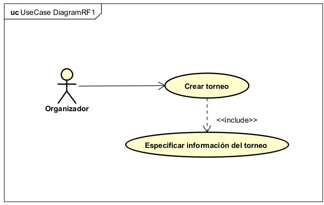
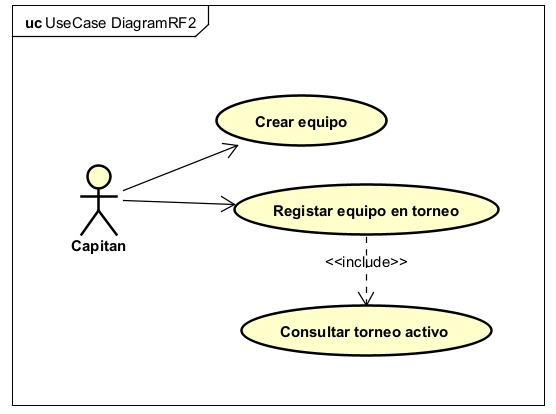
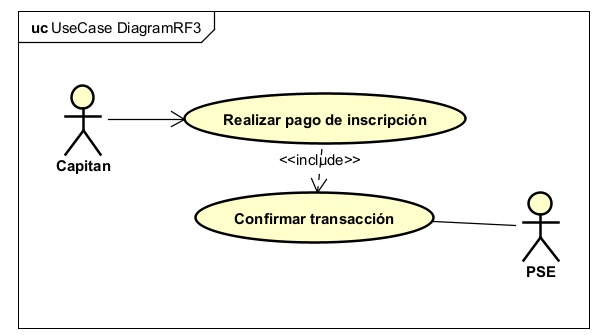

# Requerimientos del Sistema

## 1. Lista general de requerimientos

El sistema de TechCup tiene los siguientes requerimientos (descripción a alto nivel):

### 1.1 Requerimientos funcionales

El sistema de TechCup debe tener la capacidad de:

- **RF-01:** Permitir a los organizadores crear un torneo especificando fechas, cuota de inscripción y demás información básica.
- **RF-02:** Permitir a los capitanes crear un equipo y registrarlo en el torneo activo.
- **RF-03:** Permitir a los capitanes realizar el pago de inscripción de su equipo a través de PSE.
- **RF-04:** Permitir a los organizadores validar y aprobar el pago de inscripción de un equipo.
- **RF-05:** Permitir a los organizadores generar un reporte de los equipos registrados en un torneo.

### 1.2 Requerimientos no funcionales

El sistema de TechCup debe tener:

- **RNF-01 (Seguridad):** Cifrado de las contraseñas de los usuarios almacenadas en la base de datos.
- **RNF-02 (Disponibilidad):** Disponibilidad de al menos el 99% del tiempo durante los períodos de inscripción de torneos.
- **RNF-03 (Usabilidad):** Una interfaz que permita a un capitán completar el registro de su equipo en menos de 5 minutos.
- **RNF-04 (Rendimiento):** Generación de los reportes de registro e ingresos en un tiempo no mayor a 5 segundos.
- **RNF-05 (Interoperabilidad):** Capacidad de enviar el reporte de pagos de inscripción a la Decanatura en formato JSON.

## 2. Diagramas de caso de uso

### 2.1 Requerimiento Funcional 1

| Campo | Descripción |
|---|---|
| ID | RF-01 |
| Nombre del requerimiento | Crear Torneo |
| Descripción | El sistema debe permitir a un organizador autenticado crear un nuevo torneo, especificando su fecha, la cuota de inscripción y demás información básica. |
| Precondiciones | Para que el sistema cumpla con este requerimiento, TechCup debe tener previamente al organizador autenticado y no debe existir un torneo con el mismo ID (año + semestre). |
| Actor | Organizador |
| Flujo principal | 1. El organizador inicia sesión en el sistema. 2. El organizador selecciona la opción "Crear torneo". 3. El sistema muestra un formulario solicitando fecha, cuota de inscripción y demás información básica. 4. El organizador diligencia los campos y confirma la creación. 5. El sistema valida que el torneo no exceda un día de duración y que el ID sea único. 6. El sistema crea el torneo con estado inicial "Pendiente" y lo almacena. 7. El sistema confirma la creación al organizador. |
| Diagrama de caso de uso |  |
| Poscondiciones | Se espera como resultado un nuevo torneo creado con estado "Pendiente", disponible para su posterior activación. |

### 2.2 Requerimiento Funcional 2

| Campo | Descripción |
|---|---|
| ID | RF-02 |
| Nombre del requerimiento | Crear equipo y registrarlo en el torneo activo |
| Descripción | El sistema debe permitir a los capitanes crear un equipo y registrarlo en el torneo que se encuentre actualmente en estado "Activo". |
| Precondiciones | Para que el sistema cumpla con este requerimiento, debe existir un torneo en estado "Activo" y el capitán debe estar autenticado en el sistema. |
| Actor | Capitán |
| Flujo principal | 1. El capitán inicia sesión en el sistema. 2. El capitán selecciona la opción "Crear equipo". 3. El capitán ingresa la información del equipo (nombre, integrantes, etc.). 4. El sistema consulta cuál es el torneo activo. 5. El sistema registra el equipo asociado a ese torneo. |
| Diagrama de caso de uso |  |
| Poscondiciones | El equipo queda creado y registrado en el torneo activo, quedando disponible para continuar con el proceso de pago de inscripción (RF-03). |

### 2.3 Requerimiento Funcional 3

| Campo | Descripción |
|---|---|
| ID | RF-03 |
| Nombre del requerimiento | Pago de inscripción vía PSE |
| Descripción | El sistema debe permitir a los capitanes realizar el pago de inscripción de su equipo a través de PSE. |
| Precondiciones | El equipo debe estar previamente creado y registrado en el torneo activo (RF-02). El capitán debe estar autenticado en el sistema. |
| Actor | Capitán, PSE |
| Flujo principal | 1. El capitán selecciona la opción "Realizar pago de inscripción". 2. El sistema redirige al capitán a la pasarela de pagos PSE. 3. El capitán completa la transacción en PSE. 4. PSE confirma la transacción al sistema. 5. El sistema registra el pago como pendiente de validación. |
| Diagrama de caso de uso |  |
| Poscondiciones | El pago queda registrado como "pendiente de validación" hasta que un organizador lo apruebe (RF-04). |

## 3. Preguntas

**¿Identifican algún requerimiento que necesite más detalle? ¿Cuál(es)?**

Sí, el RF-04 (validar y aprobar el pago) nos parece que le falta más detalle. No queda claro qué pasa si el organizador rechaza un pago, ni si el capitán recibe alguna notificación cuando eso pasa. Habría que definir mejor ese flujo antes de empezar a implementarlo.

**¿Hay requerimientos que se contradigan entre sí? ¿Cuál(es)?**

Sí. En las reglas de negocio se dice que los torneos no se pueden eliminar, pero en las funcionalidades generales se menciona que el sistema debe permitir eliminar un torneo y sus equipos registrados. Le consultamos esto al profesor en clase y la solución que definimos fue: un torneo solo se puede eliminar (junto con sus equipos) si aún no existen pagos registrados para ninguno de sus equipos. Si ya existe al menos un pago realizado, el sistema debe rechazar la operación de eliminación, porque el torneo ya tiene compromisos económicos en curso.

**Si tuvieran que priorizar, ¿cuáles 2 requerimientos serían los más importantes para la primera iteración?**

RF-01 (crear torneo) y RF-02 (crear equipo y registrarlo), porque sin esos dos no existe nada más que hacer en el sistema — son la base para que exista un torneo y para que un equipo pueda participar. Los demás (pago, validación, reportes) dependen de que estos dos ya funcionen.

**¿Hay algún requerimiento que no debería implementarse?**

Consideramos que el RNF-05 (enviar el reporte en formato JSON a la Decanatura) podría dejarse para una versión posterior, ya que no es algo que afecte directamente la experiencia de organizadores o capitanes usando la plataforma, es más un tema administrativo que se podría resolver manualmente al principio.